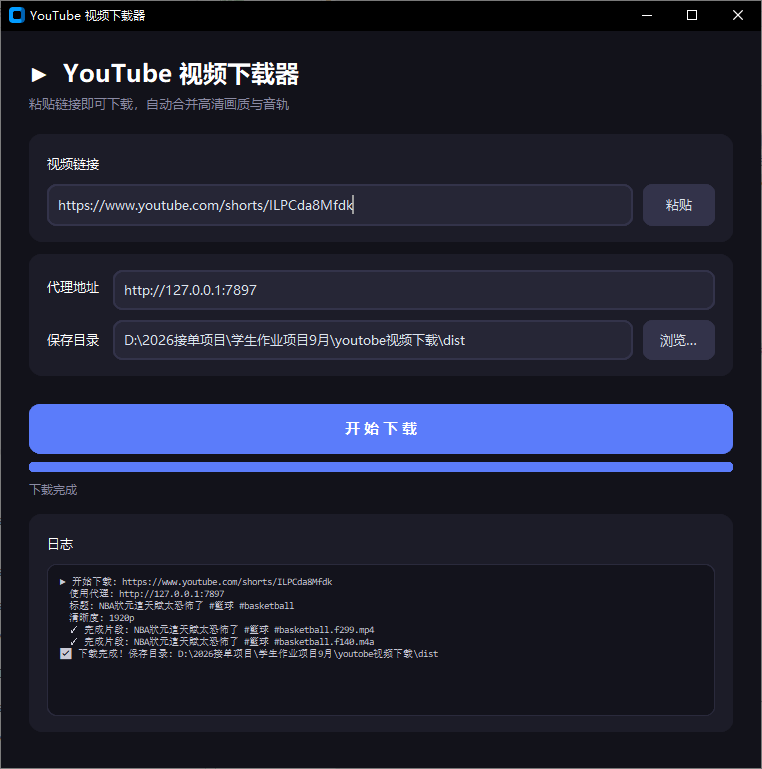

# YouTube 视频下载器

一个基于 Python 的 YouTube 视频下载工具，提供现代化的图形界面，粘贴链接即可下载，自动合并高清画质与音轨，输出兼容所有播放器的 MP4 文件。

支持 YouTube 短视频（Shorts）、普通视频、B 站等 yt-dlp 支持的所有站点。

---

## ✨ 功能特性

- 🖥️ **现代深色界面**：基于 customtkinter，圆角卡片风格
- 📋 **一键粘贴下载**：自动读取剪贴板链接
- 🔀 **代理可配置**：内置代理设置，自动记忆，换电脑只需改一次
- 📊 **实时进度**：进度条 + 实时速度 / 大小显示
- 🎬 **高兼容输出**：优先 H.264 + AAC 编码，所有播放器都能放
- 📦 **可打包成 exe**：附完整 PyInstaller 打包方案

## 🛠️ 技术栈

| 组件 | 用途 |
|------|------|
| [yt-dlp](https://github.com/yt-dlp/yt-dlp) | 视频解析与下载 |
| [ffmpeg](https://ffmpeg.org/) | 音视频流合并 |
| [customtkinter](https://github.com/TomSchimansky/CustomTkinter) | 现代化界面 |
| [PyInstaller](https://pyinstaller.org/) | 打包成 exe |

## 📸 界面截图

**软件界面**



**下载效果**


## 📦 环境要求

- Python 3.9+
- ffmpeg（静态版，下载方式见下文）

## 🚀 快速开始

### 1. 安装依赖

```bash
pip install yt-dlp customtkinter
```

> 注意：yt-dlp 需保持最新版，YouTube 接口频繁变动：
> ```bash
> pip install -U yt-dlp
> ```

### 2. 安装 ffmpeg

项目目录下需要 `ffmpeg.exe` 和 `ffprobe.exe`。推荐从国内镜像下载静态版（不依赖 dll，解压即用）：

```bash
# Windows（静态版，走阿里云 npmmirror 镜像，国内速度快）
curl -sL -o ffmpeg.gz "https://registry.npmmirror.com/-/binary/ffmpeg-static/b6.1.1/ffmpeg-win32-x64.gz"
curl -sL -o ffprobe.gz "https://registry.npmmirror.com/-/binary/ffmpeg-static/b6.1.1/ffprobe-win32-x64.gz"
gunzip -f ffmpeg.gz && mv ffmpeg ffmpeg.exe
gunzip -f ffprobe.gz && mv ffprobe ffprobe.exe
```

> 也可以去 [ffmpeg.org](https://ffmpeg.org/download.html) 或 [gyan.dev](https://www.gyan.dev/ffmpeg/builds/) 下载，把 `ffmpeg.exe`、`ffprobe.exe` 放到项目目录即可。

### 3. 运行

```bash
# 图形界面版
python YouTubeDownLoad.py

# 命令行版
python download.py "https://www.youtube.com/watch?v=xxxx"
```

## ⚙️ 代理配置

国内访问 YouTube 需要代理。在 GUI 界面的「代理地址」栏填写你的代理，**会自动保存到 `config.json`**，下次启动自动读取。

默认值为 `http://127.0.0.1:7897`，请改成你自己代理软件的端口。

常见代理软件默认端口：

| 软件 | 端口 |
|------|------|
| Clash / Clash Verge | `7890` / `7897` |
| V2rayN | `10808`（socks）/ `10809`（http） |
| Shadowsocks | `1080` |

> 不知道端口？在命令行执行 `netstat -ano | findstr LISTENING`，找到你代理软件的监听端口。

## 📖 使用说明

### 图形界面

1. 运行 `python YouTubeDownLoad.py`
2. 粘贴 YouTube 链接
3. 确认代理地址
4. 点击「开始下载」

### 命令行

```bash
python download.py "视频链接"
```

可选：通过环境变量设置代理

```bash
# Windows
set YT_PROXY=http://127.0.0.1:7897
python download.py "视频链接"
```

## 📦 打包成 exe

```bash
pyinstaller --onefile --noconsole --noconfirm --clean \
  --name="youtube视频下载" \
  --collect-all yt_dlp \
  --collect-all customtkinter \
  YouTubeDownLoad.py
```

> ⚠️ 关键点：
> - 必须加 `--collect-all yt_dlp`，否则解析器不会被打包进去
> - 打包后要把 `ffmpeg.exe`、`ffprobe.exe` 放到 exe 同一目录
> - 打包前关闭正在运行的旧 exe，否则会报「拒绝访问」

## ❓ 常见问题

| 现象 | 原因 | 解决 |
|------|------|------|
| `timed out` | 未走代理 | 填写正确的代理地址 |
| `SABR streaming` / `page needs to be reloaded` | yt-dlp 版本旧 | `pip install -U yt-dlp` |
| `Requested format is not available` | 缺 ffmpeg | 按上文安装 ffmpeg |
| 只有声音没画面 | 视频是 AV1 编码，播放器不支持 | 已默认选 H.264，如手动改过请改回 |
| 打包后报「拒绝访问」 | 旧 exe 还在运行 | 关掉进程再打包 |

## ⚠️ 免责声明

本项目仅供学习交流使用。请遵守当地法律法规及 YouTube 服务条款，不要下载受版权保护的内容或用于商业用途。

## 🌟 支持项目

如果这个项目对你有帮助，欢迎点个 **Star ⭐** 收藏，这是对我最大的鼓励！

**打赏支持**


**联系作者 / 交流**


感谢每一位支持的朋友 🙏

## 📄 许可证

[MIT License](LICENSE)
